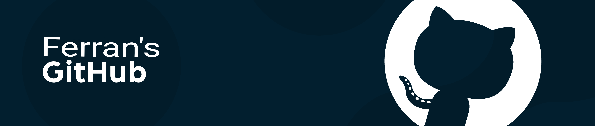

[](https://ferrannl.github.io/Projects/)

# 🚀 Ferran’s Projects Portfolio

_All my GitHub work in one place — client websites, school projects, APIs, mobile apps, games, utilities and random experiments._

[](https://github.com/ferrannl)
[](https://github.com/ferrannl?tab=repositories)
[](https://github.com/ferrannl)

> **Live site:**  
> 👉 **https://ferrannl.github.io/Projects/**

---

## 📌 What is this repo?

This is the code for **my interactive portfolio hub**:

- Lists **all (public) GitHub repositories** in a clean, filterable UI  
- Pulls in extra metadata from local JSON (`projects.json`)  
- Shows a **curated media wall** (images, videos, audio) from `media.json`  
- Includes a **Playground** with:
  - embedded **MS Paint** clone  
  - a “take me to a random website” button  
  - (and more fun stuff I’ll add over time)

The site is deployed via **GitHub Pages** from this repository.

---

## 🧩 Main Features

### 🎛 Smart project grid

- Fetches repositories from the GitHub API for `@ferrannl`
- Merges them with **local overrides** from `projects/projects.json`
- Projects can have:
  - ✅ Normalized display names  
  - ✅ Custom descriptions  
  - ✅ Explicit `type` (Website / Mobile / API / School / Game / Other)  
  - ✅ **Multiple tags** (e.g. `Mobile + API`, `Website + Game`, `School / Study + Security`)  
  - ✅ Custom thumbnail, live URL, languages

### 🧠 Automatic type & tag detection

Heuristics detect things like:

- **Game**, **Mobile**, **API / Backend**, **School / Study**, **Website**, **Other**
- Extra **Security** tag for security-ish/devops style projects  
- Special handling for `.NET` / `ASP.NET` projects  
- Filters out weird languages like `Roff`, `Nix`, `Emacs Lisp` from the language list

### 🖼 Thumbnails with smart priority

For each repo, the app:

1. Looks for a thumbnail override in `projects.json`
2. Otherwise scans the **repo root** via GitHub API and prefers:
   1. `logo.gif` (animated thumbnail if available)  
   2. `logo.png`  
   3. other `logo.*` files  
   4. diagrams (e.g. `*diagram*`)  
   5. any other image as a fallback
3. If nothing useful is found, falls back to the GitHub **Open Graph** image.

This keeps thumbnails consistent and relevant.

### 🎧 Media wall

- Reads from `media/media.json`
- Supports:
  - **Images** (click to open a full-screen modal)
  - **Videos** (with HTML5 player, custom volume slider & loop toggle)
  - **Audio** (HTML5 player + volume slider)
- Extra UX:
  - Only one video plays at a time
  - Avatar ring reacts to playing media (if enabled in the UI)

### 🎠 Playground

- Embedded **MS Paint** (`https://paint.js.org/`) with custom styling
- Extra controls around the Paint playground (Open / Save / Clear / New, with keyboard shortcuts)  
- A big shiny **“Take me to a random website”** button using a curated list of weird / fun sites  
- Space reserved for a small **Postboard** where people can leave me a message (anonymous optional)

---

## 🧰 Tech Stack

### Frontend

- **HTML5** + **CSS3** (no heavy framework)
- **Vanilla JavaScript** for:
  - dynamic DOM rendering
  - GitHub API integration
  - filters, search, modals
  - media controls & volume sliders
  - i18n (multi-language)
- **YouTube IFrame API** for a secret background video mode

### Backend / APIs

- The site itself is **static**, but:
  - talks to **GitHub REST API** for repo data
  - uses raw GitHub content URLs for thumbnails
- Extra backend / API work lives in **other repos** (this portfolio just surfaces them).

### DevOps & Automation

- **GitHub Actions**:
  - `update-media.yml` → generates `media/media.json`
  - `update-projects.yml` → generates `projects/projects.json`
  - `update-readme-badges.yml` → updates badges + “Last updated” timestamp in this README

---

## 🌍 Internationalization (i18n)

The site is localized and has a **language gate** when you first visit.

Supported languages:

- 🇳🇱 **Nederlands** (default)
- 🇬🇧 **English**
- 🇩🇪 **Deutsch**
- 🇵🇱 **Polski**
- 🇹🇷 **Türkçe**
- 🇪🇸 **Español**

Key points:

- All translatable texts are in a JS **`I18N` dictionary**.
- Active language is stored in `localStorage`, so it remembers your choice.
- You can change the language later via the **🌐 language pill** top-right.

---

## 🧱 Project Structure

High-level layout (simplified):

```text
Projects/
├── assets/
│   ├── banner.png
│   ├── profile.jpg
│   ├── github_icon.png
│   ├── reddit_icon.png
│   ├── tumblr_icon.png
│   └── ...other UI icons
│
├── css/
│   └── style.css           # Main styles (layout, cards, modals, playground, etc.)
│
├── js/
│   └── main.js             # All logic: tabs, filters, GitHub fetch, media, i18n, etc.
│
├── media/
│   ├── images/             # Image assets surfaced in the Media tab
│   ├── audio/              # Audio files surfaced in the Media tab
│   ├── videos/             # Video files surfaced in the Media tab
│   └── media.json          # Auto-generated media index
│
├── projects/
│   └── projects.json       # Auto-generated project override metadata
│
├── python/
│   ├── update_media.py     # Script to scan media/ and generate media.json
│   └── update_projects.py  # Script to build projects.json for the site
│
├── .github/
│   └── workflows/
│       ├── update-media.yml        # Runs update_media.py on changes / schedule
│       ├── update-projects.yml     # Runs update_projects.py on changes / schedule
│       └── update-readme-badges.yml# Updates badges + last updated in README
│
├── index.html               # Main portfolio page (GitHub Pages entrypoint)
└── README.md                # You are here
````

---

## ⚙️ GitHub Actions Workflows

### 🔄 1. Update README badges

```yaml
name: Update README badges

on:
  workflow_dispatch:
  schedule:
    # run daily at 04:00 UTC
    - cron: "0 4 * * *"

jobs:
  update-readme:
    runs-on: ubuntu-latest

    permissions:
      contents: write

    steps:
      - name: Check out repo
        uses: actions/checkout@v4

      - name: Update badges and timestamp in README
        uses: actions/github-script@v7
        with:
          github-token: ${{ secrets.GITHUB_TOKEN }}
          script: |
            const fs = require("fs");
            const path = require("path");

            const owner = context.repo.owner;
            const repo = context.repo.repo;

            // 1) Fetch profile data
            const { data: user } = await github.rest.users.getByUsername({ username: owner });
            const followers = user.followers;
            const publicRepos = user.public_repos;
            const updatedAt = new Date().toISOString().replace(/T/, " ").replace(/\..+/, " UTC");

            // 2) Load README.md
            const readmePath = path.join(process.cwd(), "README.md");
            let readme = fs.readFileSync(readmePath, "utf8");

            // 3) Replace follower + repo badges dynamically
            readme = readme.replace(
              /!\[GitHub followers\]\([^)]+\)/,
              ``
            );

            readme = readme.replace(
              /!\[Public repos\]\([^)]+\)/,
              ``
            );

            // 4) Ensure a "Last updated" footer exists
            if (readme.includes("Last updated: 2025-12-16 04:28:29 UTC
              readme = readme.replace(/Last updated:.*/, `Last updated: ${updatedAt}`);
            } else {
              readme += `\n\n---\n_Last updated: ${updatedAt}_\n`;
            }

            // 5) Commit back if changed
            const oldContent = (
              await github.rest.repos.getContent({
                owner,
                repo,
                path: "README.md",
              })
            ).data;

            const oldDecoded = Buffer.from(oldContent.content, "base64").toString("utf8");

            if (oldDecoded === readme) {
              core.info("No README changes detected.");
              return;
            }

            await github.rest.repos.createOrUpdateFileContents({
              owner,
              repo,
              path: "README.md",
              message: "chore: update README badges and timestamp",
              content: Buffer.from(readme, "utf8").toString("base64"),
              sha: oldContent.sha,
            });

            core.info("README.md updated successfully.");
```

> ✅ As long as the README contains the two badges with alt text
> `![GitHub followers]` and `![Public repos]`, this workflow will keep them updated.

### 🧮 2. Update projects.json

* Triggered when:

  * `python/update_projects.py` changes
  * workflow file changes
  * or on a daily schedule (depending on your config)
* Uses the GitHub API to:

  * fetch repo list
  * apply overrides
  * write `projects/projects.json`
* The frontend then reads that file to render the grid.

### 🖼 3. Update media.json

* Similar idea for media files:

  * Scans `media/` folders
  * Builds `media/media.json`
  * Makes the Media tab fully data-driven

---

## 🧪 Local Development

1. Clone the repo:

   ```bash
   git clone https://github.com/ferrannl/Projects.git
   cd Projects
   ```

2. (Optional) Build / refresh JSON indexes locally:

   ```bash
   # Requires Python + requests
   pip install -r requirements.txt  # if you have one, or just: pip install requests
   python python/update_projects.py
   python python/update_media.py
   ```

3. Open `index.html` in a browser:

   * simplest: just double-click it
   * or serve via a tiny HTTP server:

   ```bash
   # Python 3
   python -m http.server 8000
   # then go to http://localhost:8000
   ```

4. Commit & push — GitHub Pages will serve the updated site from the default branch.

---

## 🤝 Contributing / Future ideas

This repo is mostly personal, but I’m always open to ideas / PRs that:

* Improve UX or accessibility
* Make the project / media detection logic smarter
* Add more fun Playground tools
* Improve i18n coverage or add new languages

If you open a PR, keep the code:

* framework-free (vanilla JS only)
* readable, with small helper functions
* consistent with existing styling & naming.

---

## 📬 Contact

* **Email:** [ferranhendriks@outlook.com](mailto:ferranhendriks@outlook.com)
* **Portfolio:** [ferrannl.github.io/Projects](https://ferrannl.github.io/Projects/)
* **X / Twitter:** [PikalexNL](https://x.com/PikalexNL)
* **Twitch:** [PikalexNL](https://twitch.tv/PikalexNL)
* **Reddit:** [PikalexNL](https://www.reddit.com/user/PikalexNL)
* **Discord:** [@kadavernl](https://discord.com/users/276441877497118721)
* **GitHub:** [@ferrannl](https://github.com/ferrannl)

---

*Last updated: 2025-12-10 11:01:52 UTC*
